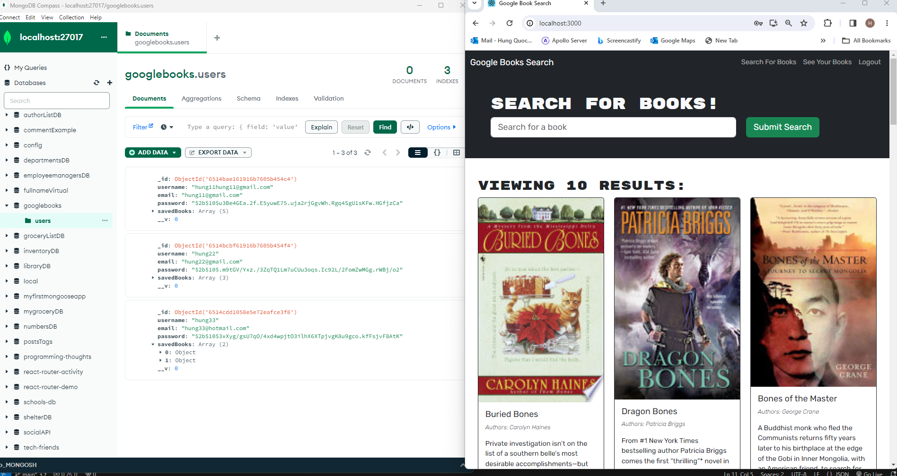

# GoogleBook MERN  by Hung Quoc Dang

## Summary

This MERN codes,  will show the search of books, from Internet, users can save or removed the selected books. To clone it from GitHub then do:

npm i 

npm start

Then a browser will open for users to interact with the page.

